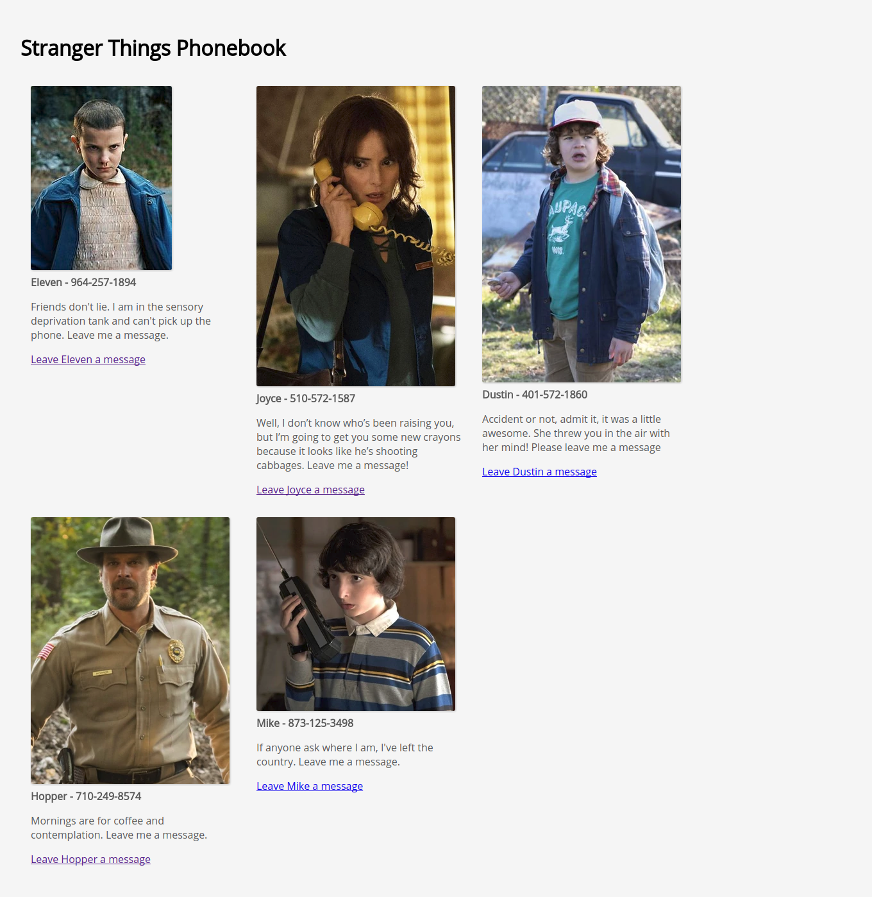

# Stranger Things Telephone

You are making an app that shows some characters from _Stranger Things_ and allows the user to send a character a message.

You'll need to:
* Read a list of characters and their info from an external URL
* Read values from a text input and textarea
* Send form data to an external URL
* Deploy to a public URL

## Steps

1. Using the included `app.js` file, make a `GET` request using the fetch API to the URL `https://quiet-bayou-99554.herokuapp.com/api/v1/contacts`.

Once you have the data, add the following elements to the page. (Note: the styles are done for you.)
* An `li` for each character that includes:
  * An `img` tag that renders the character's image
  * A `span` tag that displays the character's name and phone number
  * A `p` tag that displays the character's Message
  * An `a` tag that says 'Leave `${character.name}` a Message' and when clicked takes the user to the `contact.html` page.
* When finished, your home page should look like this:

2. Using the included `contact.html` file, create a form that includes:
    * A name input (with a label)
    * A textarea (with the label 'message')
    * A submit button
    * When finished, your form should look like this:

3. Using the included `form.js` file, add the following behavior when the submit button is clicked:
    * The default behavior should be prevented
    * The form values should be `POST`ed to `https://quiet-bayou-99554.herokuapp.com/api/v1/contacts` in the following format:
        * `{name: "Joyce", message: "Chill out."}`
1. If you properly format the data and send it using a `POST` request, 
