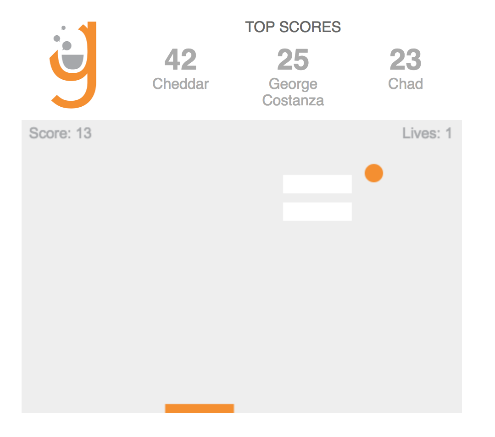

## Galvanize Telephone Pong

We've built a game from the tutorial [2D Breakout Game in Pure JavaScript](https://developer.mozilla.org/en-US/docs/Games/Tutorials/2D_Breakout_game_pure_JavaScript) using some Galvanize flavoring.

Use the [Leaderboard API](https://galvanize-leader-board.herokuapp.com/) to read and add scores to this game. Read the documentation at the link to learn the data format. This game uses the game name `GBP`. The only file you are required to edit is `app.js`. If you want to get the page to match the exact styles, you can edit the css. Editing the CSS is optional. 

* On page load, get the latest scores from the API and add them to the `.scores` list. For the top three scores (in descending order):
    * Make a `p` tag with the class of `score-card`
    * Inside of that tag, make a `span` with the class of `player-name` with the player's name in it
    * Next to that tag, add a `span` with the class of `score` with the player's score in it
* When the `canvas` element fires a `gameOver` event:
    * Alert the final score to the user
    * Post the player's score (accessible via the global `score` variable) to the Leaderboard API
    * Get the latest scores again and rewrite them to the page
    * Log any errors from the API with `console.error`
* Deploy your work and add a link to it [here](#)
